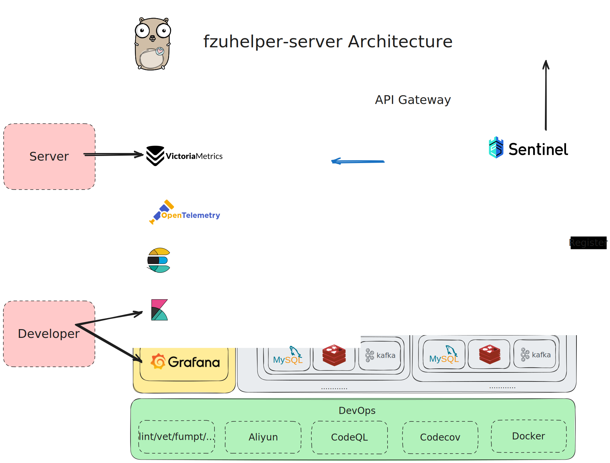

> WARNING(Chinese only): 本项目受福州大学统一指导，由福州大学计算机与大数据学院、福州大学网络安全与信息化办公室管理（以上单位合称"官方"）。这份源代码使用了宽松开源协议，但源码仅供学习参考，不允许该项目直接或间接性使用/修改后使用在任何非官方和 west2-online 外的应用、网站、app 及任何可以与用户产生交互的互联网信息媒介中。该警告具备行政约束效力。

<div align="center">
  <h1 style="display: inline-block; vertical-align: middle;">fzuhelper-server</h1>
</div>

<div align="center">
  <a href="#overview">English</a> | <a href="docs/README.zh.md">中文</a>
</div>

## <a id="overview"></a>Overview

fzuhelper-server is a distributed architecture-based server application for fzuhelper, which has been in use since 2024, serving **over 23,000 students** from Fuzhou University everyday ([Data source and introduction to fzuhelper](https://west2-online.feishu.cn/wiki/RG3UwWGqPig8lHk0mYsccKWRnrd)).

This project focuses on business implementation. To see how we interface with the academic affairs office, you can check out our open-source version at [west2-online/jwch](https://github.com/west2-online/jwch).

> fzuhelper was launched in 2015, developed from scratch by west2-online and continuously operated, providing students with industrial-grade practice as much as possible on campus and offering robust support for student employment.

## Features

- **Cloud-Native**: native golang distributed architecture design, based on ByteDance's best practices.
- **High Performance**: Supports asynchronous RPC, non-blocking I/O, shared memory communication, and Just-In-Time (JIT) compilation.
- **Scalability**: Features a modular, layered structural design, with clear and readable code, reducing development difficulty.
- **DevOps**：An abundance of scripts and tools reduce unnecessary manual labor, simplifying usage and deployment.

## Project structure

```bash
.
├── .golangci.yml              # GolangCI configuration
├── .licenseignore
├── go.mod
├── go.sum
├── LICENSE
├── Makefile                   # some useful commands
├── README.md
├── api                       # gateway
├── cmd                       # microservices entry
├── config                    # configuration files and examples
├── docker                    # Docker build configuration
├── docs
├── hack                      # tools for automating development, building, and deployment tasks
├── idl                       # interface definition
├── internal                  # microservices implementation
├── kitex_gen                 # kitex generated code
└── pkg
    ├── base/                 # common base service
    │   └── client/           # client for corresponding components (redis, mysql e.g.)
    ├── cache/                # cache service
    ├── db/                   # database service
    ├── constants/            # store any consts
    ├── errno/                # custom error
    ├── eshook                # elasticsearch hook
    ├── logger/               # logging system
    ├── tracer/               # for jaeger
    └── utils/                # useful funcs
```

## Quick start and deploy

Due to the script we have written, the process has been greatly simplified. You just need to use the following command to quickly start the environment and run the program in a containerized manner.

please visit: [deploy](docs/deploy.md)

## Architecture



## Contributors


If you are interested in joining the maintenance of fzuhelper-server, please contact us on our [official website](https://site.west2.online)

## License

`fzuhelper-server` is licensed under the Apache 2.0 license. See the LICENSE file for details.
