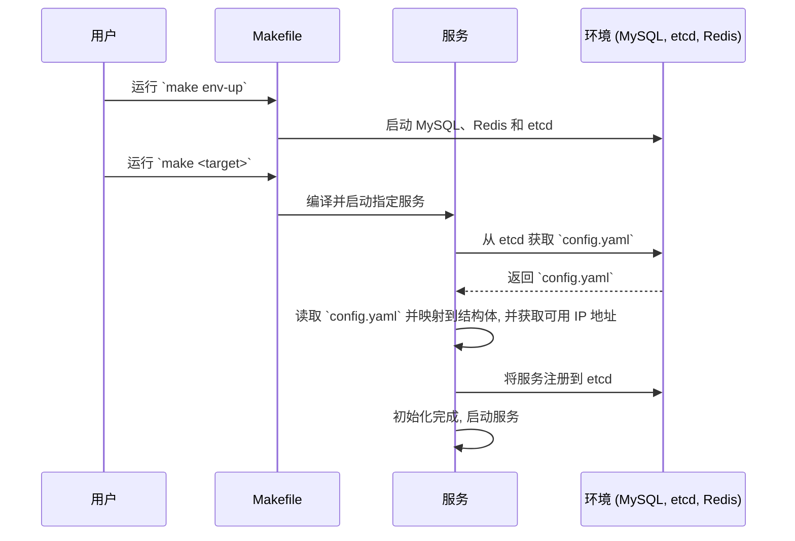
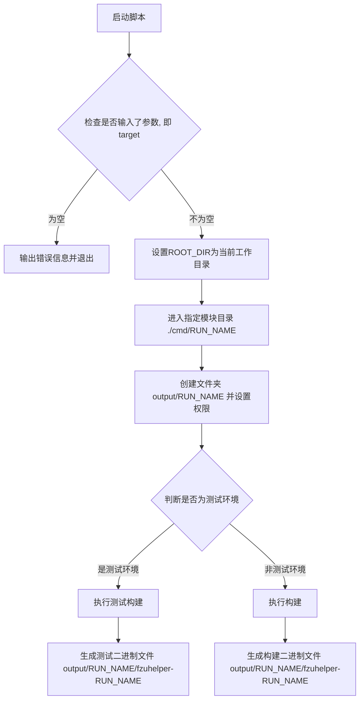
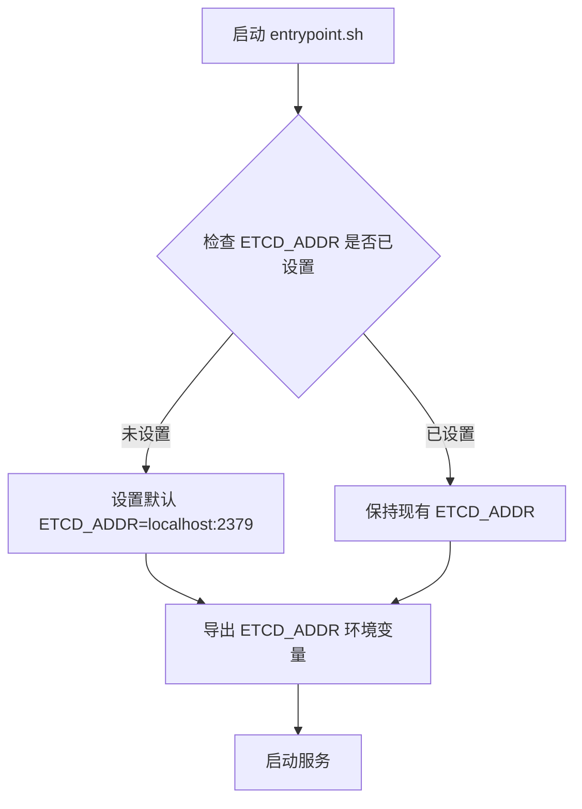
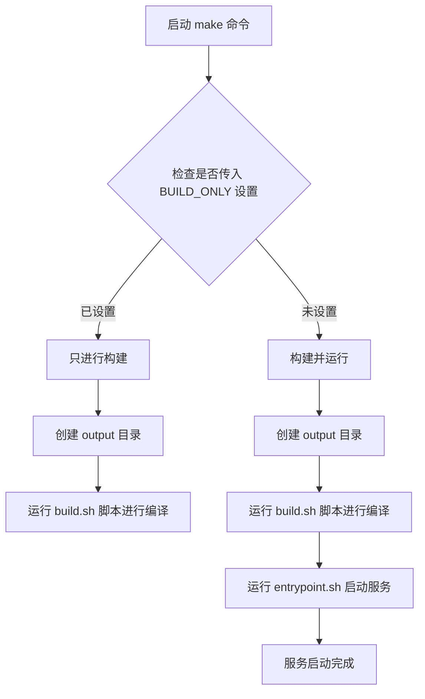

# Build

该指南将主要介绍项目的构建和启动流程，以及相关的脚本

后续的 `<target>` 指代某个服务，例如 `api`，具体可以通过 `make help` 获取可构建服务列表

## 大致流程

1. 使用命令 `make env-up` 启动环境（MySQL、etcd、Redis 等）
2. `make <target>` 编译并运行具体的服务
3. 服务从 etcd 中获取 `config.yaml`
4. 读取 `config.yaml` 中的配置，将 Env 映射到对应的 **结构体** 中
5. 从 `config.yaml` 中获取可用地址
6. 初始化服务，将服务注册到 `etcd` 中
7. 启动服务



## 构建和启动

### 目录结构

项目的关键目录如下

- `cmd/`：包含各服务模块的启动入口
- `output/`：构建产物的输出目录

### 构建流程

此处阐述当我们敲下 `make <target>` 时具体的工作流程，我们省略了 tmux 环境的相关内容

构建过程主要通过 [build.sh](../docker/script/build.sh) 脚本完成，用于编译指定服务模块的二进制文件或进行系统测试

1. 进入到 cmd 中的对应服务文件夹下
2. 执行 `go build` 以编译该服务的二进制文件，并存放到 `output` 文件夹内



### output 目录结构

```text
 output
 └── target
        └── binary
```

### 启动流程

当我们敲下 `make <target>` 而没有设置仅构建标志（`BUILD_ONLY`）时，会自动启动，这里介绍本地调试启动的过程

> Docker 容器的启动过程是类似的，只是将其移动至容器内

启动过程主要通过 [entrypoint.sh](/docker/script/entrypoint.sh) 脚本完成

1. 通过`export`设置 etcd 的地址的环境变量，为后续程序在 **运行时** 能够获取到 etcd 的地址并获取 `config.yaml`
2. `cd` 到构建阶段生成的 output 目录，执行对应服务的二进制文件



## 使用方式

两份脚本都由 `Makefile` 中的命令接管，可以通过以下命令调用：

```shell
make <target> [option]   # option = BUILD_ONLY
```

以下是 `make <target>` 的大致流程图：


