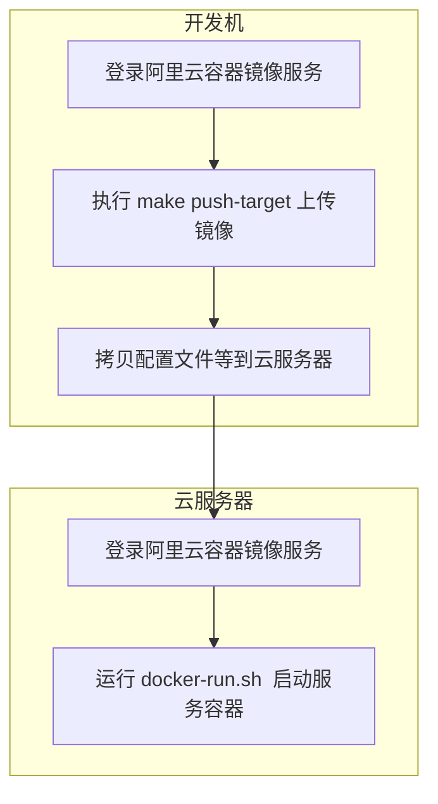

# Deploy

这份指南将从零开始部署本项目。

在部署过程中，我们将使用 Makefile 中的命令来启动依赖的环境（包括 MySQL、etcd、Redis 等数据库和缓存服务），然后编译并运行特定的服务。

如果对具体的构建和启动流程感兴趣，请查阅 [Build](./build.md) 页面。

## 先决条件

需要安装的软件包：

- Docker
  - 请参考 [Docker 官方文档](https://docs.docker.com/get-docker/) 安装 Docker。
  - 用于启动 MySQL、etcd、Redis 等服务。
- tmux
  - 便于在终端中管理多个会话，提高运维效率。
  - Makefile 中的命令会默认在 tmux 中执行。

## 本地部署

### 预备操作

修改 `config/config.yaml` 的配置，将数据库等配置的 ip 修改为 `localhost`（如果没有请新增这个文件）。配置示例请参考 `config.example.yaml`。

### 启动环境

#### 清理本地环境（可选）

```shell
make clean-all
```

#### kafka 环境准备（可选）

**注意**：这个脚本内含一个 Password，可以按需修改。

```shell
sh docker/script/generate_certs_for_kafka.sh
```

#### 启动环境基础容器（数据库等）

```shell
make env-up
```

### 启动特定服务

```shell
make <target>
```

`<target>` 为服务名称，即 `cmd` 目录下的文件夹名称。

## 服务器部署

_此部分供 west2-online 成员参考_

先决条件: 服务器上已经安装并启动 Docker 服务。

### 登录阿里云容器镜像服务

在开发机和服务器上都要登录阿里云的容器镜像仓库。

```shell
docker login --username=west2gold@aliyun.com registry.cn-hangzhou.aliyuncs.com
```

密码请参阅 [飞书文档](https://west2-online.feishu.cn/wiki/Bnvhw9adGizcOFk5jRccOWnbn1g)（需要登录公司飞书账号且具备一定权限）。

### 上传镜像

现在切换到开发机上，cd 到项目的根目录下，然后执行以下命令：

```shell
make push-<target> # make push-api
```

开始运行命令后需要再次输入 `<target>` 作为确认，以防误操作。

### 拷贝相关文件

需要拷贝的文件清单如下，我们区分了核心节点和业务节点，这是基于分布式的设计。

> 实际上并不是完全的分布式，毕竟是学校项目，我们没有企业那么多服务器，所以我们简单分为了核心节点和业务节点。
>
> - 核心节点：服务器配置高，储存配置，作为持久化存储、消息队列、缓存应用程序的节点。
> - 业务节点：服务器配置低，实现业务功能的节点，这样满足了可以随时扩缩容的需求。
>
> 这样的设计，在经费不足的时候也可以统一一个节点，适配性较高。

| 文件                                                          | 路径                            |
| ------------------------------------------------------------- | ------------------------------- |
| （仅核心节点需要）mysql/redis 等基础环境搭建                  | ./docker/docker-compose.yml     |
| （仅核心节点需要）etcd 持续监听配置及热更新（不需要手动调用） | ./docker/script/etcd-monitor.sh |
| （仅核心节点需要）基础环境的 env 文件等                       | ./docker/env/                   |
| （仅核心节点需要）配置文件（用于导入 etcd 中）                | ./config/config.yaml            |
| 负责读取 ACR 镜像并做比对，遇到新版本则拉取下来（但不做更新） | ./hack/image-refresh.sh         |
| 负责重启 doker 容器（往往和 image-refresh.sh 配合使用）       | ./hack/docker-run.sh            |

需要将以上文件传送到云服务器的用户主目录（`~/`）下，可以使用 `rsync` 进行这项操作：

```shell
rsync -avz ./docker/docker-compose.yml  <user>@<servier ip>:~/
# rsync -avz src <user>@<server>:~/
```

完成后的目录结构应该与下面的结构类似：

```shell
.
├── docker
│   ├── script
│   │   └── etcd-monitor.sh
│   ├── env
│   │   ├── redis.env
│   │   ├── mysql.env
│   │   └── etcd.env
│   ├── docker-compose.yaml
├── config
│   ├── sql
│   │   └── init.sql
│   └── config.yaml
└── hack
    │── image-refresh.sh
    └── docker-run.sh
```

### 启动容器

启动 `<target>` 服务容器：

```shell
bash ./hack/docker-run.sh <target>
```

- `docker-run.sh` 脚本会先主动拉取最新的镜像，然后再启动容器。

### 大致的流程图


