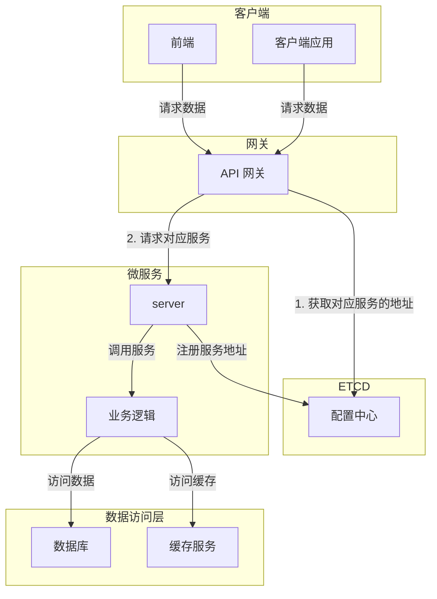
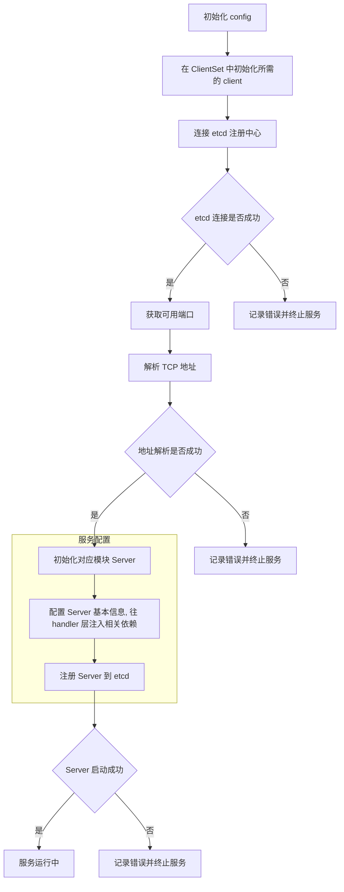
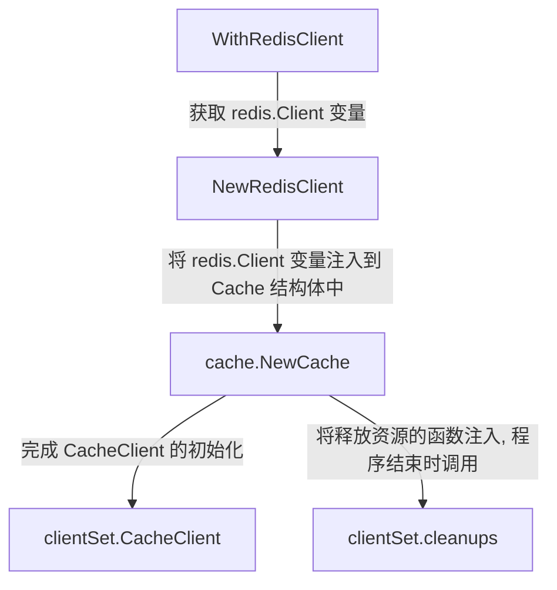
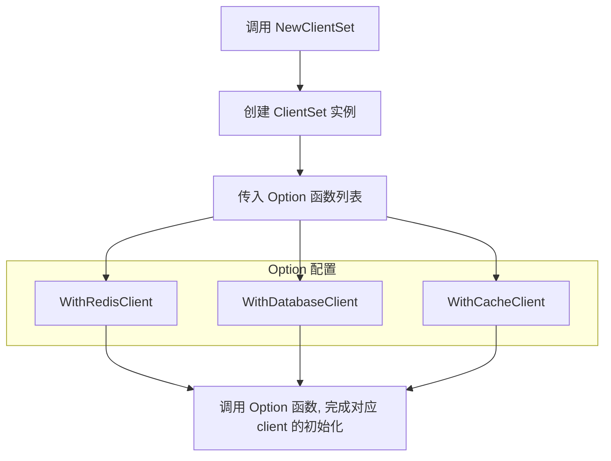
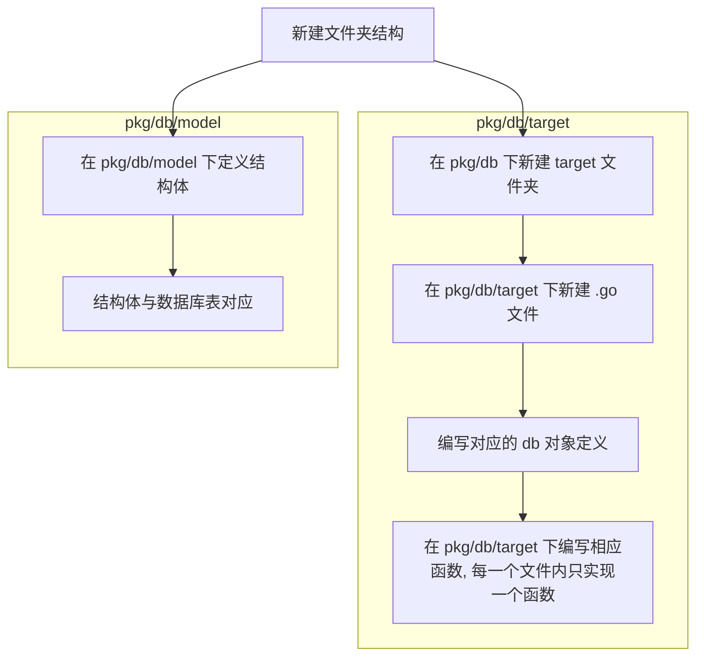
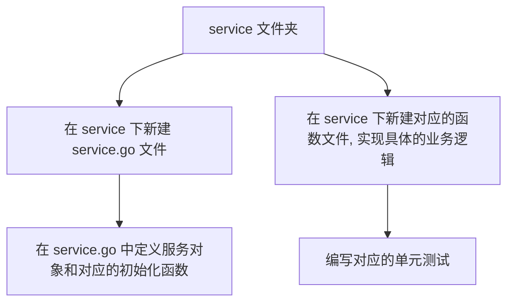
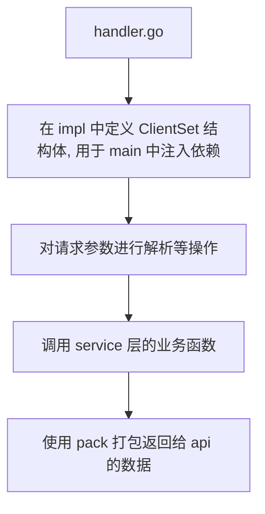

# Develop [WIP]

该文档面向想要为本项目做贡献的开发者, 介绍项目中的一些结构体系和代码规范
后续的 `<target>` 指代某个服务，例如 `api`, `course` 等

## 项目结构

### 结构图



### 项目目录

```bash
.
├── .golangci.yml              # GolangCI 配置文件
├── .licenseignore
├── go.mod
├── go.sum
├── LICENSE
├── Makefile                   # 一些 make 命令
├── README.md
├── api                       # gateway
├── cmd                       # 各个微服务的启动入口
├── config                    # 配置文件和配置示例
├── docker                    # Docker 构建配置
├── docs
├── hack                      # 用于自动化开发、构建和部署任务的工具
├── idl                       # 接口定义
├── internal                  # 各个微服务的实现
├── kitex_gen                 # Kitex 生成的代码
└── pkg
    ├── base/                 # 通用基础服务
    │   └── client/           # 对应组件(redis, mysql e.g.)的客户端
    ├── cache/                # 缓存服务
    ├── db/                   # 数据库服务
    ├── constants/            # 存储常量
    ├── errno/                # 自定义错误
    ├── eshook                # elasticsearch hook
    ├── logger/               # 日志系统
    ├── tracer/               # 用于 Jaeger 的追踪器
    └── utils/                # 实用函数
```

### 代码结构

#### 服务启动入口

该部分负责对应模块的初始化具体流程, 位于 cmd 目录下

大致流程如下



具体实现参考 [course](../cmd/course/main.go)

#### 三层架构设计

显式将代码分为三层，分别是 Handler 层、服务层和数据层

以 `course` 为例

```bash
.
├── handler.go                   # handler 层
├── pack                         # 用于打包返回给 api 的数据, 只由 handler 调用
│    └── classroom.go
├── service
     ├── get_room.go             # 服务函数实现
     ├── get_room_test.go        # 对应函数的单测
     └── service.go              # 服务的定义与实现
```

##### Handler

类似于控制层, 负责接收客户端请求，解析请求参数，并调用服务层执行具体业务

该架构层会由 kitex 框架自动生成, 表现为 `internal/<target>/handler.go` 文件

##### 服务层

服务层是编写业务逻辑的地方, 负责处理具体的业务逻辑, 调用数据层的接口完成数据的读写操作

在对应 `<target>` 目录下, 建立 `service` 文件夹, 例如 `internal/<target>/service` , 并在里面建立 `service.go` 文件, 用于定义服务对象

```go
type <target>Service struct {
	ctx   context.Context
	cache *cache.Cache  //所需要的数据库 client , 由 handler 注入
}

func New<target>Service(ctx context.Context, clientset *base.ClientSet) *<target>Service {
    return &<target>Service{
        ctx:   ctx,
        cache: clientset.CacheClient,
    }
}
```

最后为每一个服务编写对应的业务函数时, 都在 `service` 文件夹下新建立对应的文件, 例如 `<fuction>.go` , 并在里面编写对应的业务函数

##### 数据层

由于数据层的 client 对象在本项目中将其封装成了 `ClientSet` 结构体, 所以这边也将详细介绍一下

在 `pkg/base/client` 中定义了一些数据库的客户端, 例如 `mysql`, `redis` 等, 用于连接数据库和缓存服务

```go
// ClientSet storage various client objects
// Notice: some or all of them maybe nil, we should check obj when use
type ClientSet struct {
	CacheClient *cache.Cache     // Redis
	ESClient    *elastic.Client  // ElasticSearch
	DBClient    *db.Database     // Database
	SFClient    *utils.Snowflake // Snowflake(DB initialize together)
	cleanups    []func()         // Functions to clean resources
}
```

这样做的好处

1. 集中管理：所有的客户端对象都集中在一个结构体中，便于管理和维护。
2. 简化初始化：在微服务的初始化阶段，可以统一将所需的客户端对象注册到ClientSet中
3. 资源清理：通过cleanups字段，可以统一管理资源清理函数，确保在服务关闭时能够正确释放所有资源。
4. 扩展性：可以方便地添加新的客户端对象，只需在ClientSet中添加相应的字段和初始化逻辑即可

##### client 端初始化

下面以初始化 `redis` 为例

```go
type Option func(clientSet *ClientSet)
// WithRedisClient will create redis object
func WithRedisClient(dbName int) Option {
	return func(clientSet *ClientSet) {
		redisClient, err := client.NewRedisClient(dbName)
		if err != nil {
			logger.Fatalf("init cache failed, err: %v", err)
		}
		clientSet.CacheClient = cache.NewCache(redisClient)
		clientSet.cleanups = append(clientSet.cleanups, func() {
			err = redisClient.Close()
			if err != nil {
				logger.Errorf("close cache failed, err: %v", err)
			}
		})
	}
}
```

##### 大致初始化 client 流程

以初始化 redis 为例



细心的读者可能会发现, 函数的返回值是 `Option(func(clientSet *ClientSet))`, 这是一个函数类型, 与下面要介绍的 Option 设计模式有关

##### Option 设计模式

`type ClientSet struct` 将所有的数据操作相关的 client 都集中在一个结构体中。 那么在程序启动时, 可以通过 `WithRedisClient` 这种函数来初始化所需要的 client, 这样对于不需要的 client 资源在结构体中就是 `nil`, 不会造成资源的浪费

要实现这种方式, 就需要通过多个**构造函数**来初始化不同的 `client`, 而 golang 并不支持构造函数**重载**。因此, 可以通过 Option 模式可以实现这种方式来实现不同 client 的初始化

在 `NewClientSet` 函数中, 将所有的 `Option` 类型的函数都传入, 这样就可以实现多个不同 client 的初始化

```go
// NewClientSet will be protected by sync.Once for ensure only 1 instance could be created in 1 lifecycle
func NewClientSet(opt ...Option) *ClientSet {
	once.Do(func() {
		var options []Option
		instance = &ClientSet{}
		options = append(options, opt...)
		for _, opt := range options {
			opt(instance)
		}
	})
	return instance
}
```



###### 数据库操作

以 redis 为例, 在 `pkg/cache/<target>` 下, 建立所需的操作函数, 例如 `pkg/cache/classroom` 下编写对应的数据库操作函数来实现对 cache 的操作了, 具体的代码参考 [classroom](../pkg/cache/classroom)

## 动手操作初始化项目结构

该项目使用的是字节跳动开源的 kitex 框架, 该框架的文档可以参考 [kitex](https://github.com/cloudwego/kitex), 这里不在赘述其安装

### 编写接口文件

IDL位于 [idl](../idl) 下

```bash
├── target.thrift    # 具体的服务的接口
├── api.thrift       # api 网关
├── model.thrift     # 各种结构体( model )的定义
```

- 编写的时候需要对每一个定义的 model 和 字段加上注释!!!

### 使用 kitex 命令生成相关代码

在项目跟目录下运行以下命令,

```bash
make kitex-gen-<target> # make kitex-gen-api
```

### 整理目录结构

生成的代码主要位于 `kitex_gen` 和 `cmd/<target>` 下

其中 `kitex_gen` 是对应的接口定义, 不需要去关注

在 `cmd/<target>`中, 结构如下

```bash
├── build.sh
├── handler.go
├── kitex_info.yaml
├── main.go
└── script
    └── bootstrap.sh
```

1. 因为 cmd 保持的是服务的启动入口, 所以 cmd 内只保留 `main.go` 和 `kitex_info.yaml`
2. 将 `script` 和 `build.sh` 删除, 项目的构建由 `Makefile` 来完成, 如果对构建过程感兴趣可以参考[build.md](build.md)
3. 将 `handler.go` 移动到 `internal/<target>` 下

这样一来项目的框架就搭建好了

如果对 idl 文件有更新的情况下, 运行下面的命令更新依赖

```bash
make kitex-update-<target> # make kitex-update-api
```

- 只对 `kitex_gen` 目录下的文件进行更新

### 编写代码

这一部分将按照上面的三层架构来编写代码

#### data 层

在 `pkg/db` 下编写对应的数据库操作函数



#### service 层

在项目根目录下的 `internal/target/service` 中编写业务



#### Handler

在 `handler.go` 中编写对应的函数, 由框架自动生成样式



#### 启动入口

在上文中有具体讲述了 main 函数的初始化流程, 这里不再赘述[启动入口](#服务启动入口)

#### 部署

本地部署参考[build.md](build.md)
